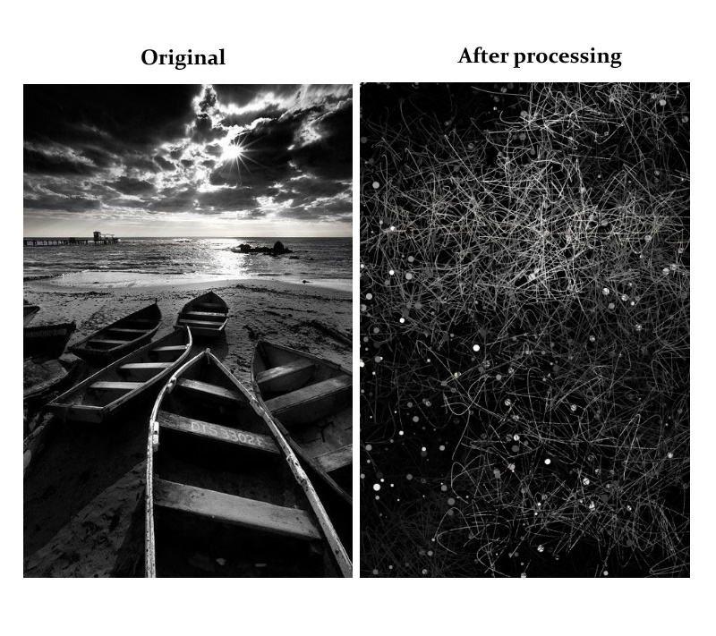

# Image-to-Abstract-Art-using-p5.js

### This is a simple script that uses the p5.js library
#### It takes an image as an input, processes it, and creates abstract art out of it
#### Processing steps are as follows:
1. Receive an image
2. Read the image pixel by pixel
3. Get the property of the pixel
4. Use the properties such as color (RGB) and its position to draw patterns
5. Generate random values and use these values to draw curves using mathematical functions such as sine, cosine etc.
   The properties of the curves generated are also random as well.
   
### The final result is as follows:

